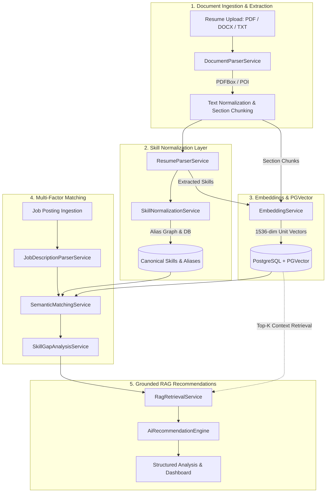

# AI Resume Intelligence Platform

[](https://openjdk.org/)
[](https://spring.io/projects/spring-boot)
[](https://spring.io/projects/spring-ai)
[](https://www.postgresql.org/)
[](https://github.com/pgvector/pgvector)
[](https://react.dev/)
[](https://www.docker.com/)

A production-quality **AI Resume Intelligence Platform** engineered to bridge the gap between unstructured candidate resumes and enterprise job specifications. Built with **Java 21**, **Spring Boot 3.4**, **Spring AI**, **PostgreSQL**, and **PGVector**, the system executes automated document ingestion (PDF, Word DOCX, Plain Text), canonical skill taxonomy normalization, dense 1536-dimensional vector embedding generation, multi-stage semantic matching, skill-gap analysis, and grounded, zero-hallucination Retrieval-Augmented Generation (RAG) recommendations.

---

## 📌 Problem

Traditional Applicant Tracking Systems (ATS) and naive keyword matchers rely almost exclusively on exact string equality (`resumeSkill.equals(jobSkill)`). This leads to critical failure modes:
1. **Vocabulary Mismatch**: A candidate listing `"Amazon Web Services"` is rejected by a system searching for `"AWS"`, or `"PostgreSQL"` is missed when a job requires `"Postgres SQL"`.
2. **Domain Blindness**: A candidate with strong experience in `"Docker"`, `"Linux"`, and `"CI/CD"` is flagged as completely unqualified for a role asking for `"Kubernetes"`, failing to recognize adjacent domain competence.
3. **Naive LLM Wrapper Failures**: Throwing an entire 4-page resume and 3-page job description blindly into a generic prompt leads to high token costs, hallucinations, and fabricated years of experience.

## 💡 Solution

The AI Resume Intelligence Platform delivers an enterprise software engineering solution that treats AI as one modular component in a structured data pipeline:
* **Multi-Format Ingestion**: Extracts text deterministically from PDF (Apache PDFBox) and DOCX (Apache POI).
* **Canonical Skill Taxonomy**: Maps raw technology variants to canonical entities and categories using a versioned relational taxonomy and alias graph.
* **1536-Dimensional Dense Embeddings**: Generates normalized unit vectors stored natively in PostgreSQL using PGVector.
* **4-Tier Matching Engine**: Combines Exact (1.00), Normalized (0.98), Alias (0.95), and Cosine Similarity (0.65 - 0.94) to evaluate qualification coverage.
* **Skill-Gap Analysis**: Classifies gaps into Critical (required) vs Moderate/Low (preferred), highlighting adjacent technology evidence.
* **Grounded RAG Synthesis**: Vector retrieval retrieves specific verified resume chunks and qualifications before synthesizing actionable resume bullet improvements, project architectures, and learning roadmaps.

---

## 🏗 System Architecture



---

## 🛠 Technology Stack

| Layer | Technology | Purpose |
|---|---|---|
| **Language** | Java 21 (LTS) | Modern switch expressions, pattern matching, virtual threads ready |
| **Framework** | Spring Boot 3.4.1 | Microservice REST architecture, HikariCP connection pooling |
| **AI & RAG** | Spring AI 1.0.0-M6 | Embedding abstractions, vector search, grounded LLM synthesis |
| **Database** | PostgreSQL 16 | Relational storage, ACID transactions, foreign keys, JSONB |
| **Vector DB** | PGVector 0.8.6 | 1536-dimensional vector similarity using cosine distance (`<=>`) |
| **Migrations** | Flyway | Versioned database schema migrations (`V1`, `V2`, `V3`) |
| **Parsers** | Apache PDFBox & Apache POI | Robust document text extraction for PDF and DOCX |
| **API Docs** | Springdoc OpenAPI 2.8.5 | Swagger UI interactive documentation at `/swagger-ui.html` |
| **Frontend** | React 18, Vite, Bootstrap 5 | Modern SaaS dashboard, glassmorphism design system, Lucide icons |
| **DevOps** | Docker & Docker Compose | Multi-stage production container builds with health checks |

---

## ⚡ Core Features

### 1. Multi-Stage Semantic Matching
Rather than binary string matching, every requirement is evaluated across 4 tiers:
```
1. Exact Match (1.00):      "Java" == "Java"
2. Normalized Match (0.98): "Spring Boot" -> "springboot" == "springboot"
3. Alias Match (0.95):      "AWS" -> "Amazon Web Services" == "Amazon Web Services"
4. Cosine Similarity:       cos(θ) = (u · v) / (||u|| ||v||) >= 0.65 threshold
```

### 2. Skill Gap Severity & Adjacent Evidence
Distinguishes between missing required skills and missing preferred skills:
* **Critical Gap**: Role requires `AWS`; resume mentions neither AWS nor direct aliases.
* **Adjacent Evidence**: The system highlights related competencies (`Docker`, `Linux`, `CI/CD`) that provide conceptual foundation.

### 3. Grounded RAG Recommendations
Generates 5 categories of actionable career advice without hallucinating fake experience:
* `SKILL_TO_LEARN`: High-priority roadmap for critical missing technologies.
* `RESUME_EMPHASIS`: Highlights matching skills that should appear higher in the resume summary.
* `PROJECT_SUGGESTION`: Concrete portfolio architecture to build and showcase on GitHub.
* `BULLET_IMPROVEMENT`: Formulates bullets using the Google XYZ framework (Action + Impact + Metric).
* `INTERVIEW_PREPARATION`: Target system design and database questions for technical screening.

### 4. Interactive Skill Taxonomy Explorer
Live search interface enabling candidates and recruiters to inspect how acronyms map to canonical entities and query vector nearest neighbors.

---

## 📐 Database Schema Architecture

Managed strictly through **Flyway versioned migrations**:

* **`resumes`**: Candidate name, contact details, summary, raw text, and parsed profile JSONB.
* **`resume_sections`**: Granular semantic chunks (Summary, Experience, Education, Skills, Projects) with `vector(1536)` embeddings.
* **`job_postings`**: Role title, company, location, employment type, required years, degree, and requirements JSONB.
* **`canonical_skills`**: Normalized catalog of 100+ engineering skills across Languages, Frameworks, Databases, Cloud & DevOps, AI/ML, Architecture, and Testing.
* **`skill_aliases`**: Mapping table resolving colloquial variants, acronyms, and version tags.
* **`analyses`**: Composite compatibility score, required skill coverage %, preferred coverage %, and semantic score.
* **`analysis_skill_matches`**: Detailed audit record of every matched skill with match type and similarity score.
* **`analysis_skill_gaps`**: Identified gap records with severity classification and adjacent evidence.
* **`analysis_recommendations`**: Structured RAG recommendations with step-by-step actionable guidance.

---

## 🚀 Running Locally

### Prerequisites
* **Java 21** or later
* **Node.js 20+** and **npm**
* **PostgreSQL 16** with PGVector extension (or Docker)

### Option 1: Full Docker Compose (Recommended)
Spin up PostgreSQL with PGVector, the Spring Boot backend, and the React frontend with a single command:

```bash
# Clone the repository
git clone https://github.com/barunchhetri/resume-intelligence-platform.git
cd resume-intelligence-platform

# Copy environment template
cp .env.example .env

# Start all services with health checks
docker compose up --build
```
* **Frontend UI**: [http://localhost:5173](http://localhost:5173)
* **Backend API**: [http://localhost:8080](http://localhost:8080)
* **Swagger Documentation**: [http://localhost:8080/swagger-ui.html](http://localhost:8080/swagger-ui.html)

---

### Option 2: Running Backend & Frontend Directly

#### 1. Backend (Spring Boot)
```bash
cd backend

# Run with local PostgreSQL or in-memory test profile
./mvnw clean spring-boot:run
```
The backend initializes on port `8080` and automatically runs Flyway migrations.

#### 2. Frontend (React + Vite)
```bash
cd frontend

# Install dependencies and start development server
npm install
npm run dev
```
The frontend starts on [http://localhost:5173](http://localhost:5173).

---

## 🧪 Testing

The test suite covers unit logic, normalization taxonomies, vector calculations, and full end-to-end integration workflows using MockMvc:

```bash
cd backend
./mvnw test
```

### Included Tests:
* `SkillNormalizationServiceTest`: Validates normalization of languages, databases, cloud acronyms, and AI tools.
* `EmbeddingServiceTest`: Verifies 1536-dimension vectors, L2 unit norm constraint, and cosine similarity properties.
* `SemanticMatchingServiceTest`: Verifies Exact, Alias, and Embedding-based match evaluations.
* `SkillGapAnalysisServiceTest`: Verifies required vs preferred gap partitioning and percentage calculations.
* `ResumeParserServiceTest`: Verifies section boundary chunking, contact extraction, and skill detection.
* `ResumeApiIntegrationTest`: End-to-end integration test validating resume ingestion, job creation, gap analysis, and legacy `/api/resume` compatibility.

---

## 🧠 Engineering Challenges & Technical Trade-offs

### 1. Normalizing Inconsistent Technical Vocabulary
* **Challenge**: Candidates write `JS`, `JavaScript`, `es6`, `Node.js`, `node`, `NodeJS`. Hardcoded string lookups quickly become unmaintainable.
* **Solution**: Developed a dual-tier approach: an in-memory high-throughput canonical catalog paired with a relational `skill_aliases` table. All tokens undergo uniform normalization (case-folding, symbol mapping, alphanumeric stripping) before lookup.

### 2. Choosing Vector Similarity Thresholds
* **Challenge**: Setting vector similarity thresholds too low produces false positives (matching `Java` with `JavaScript`); setting it too high misses valid synonyms.
* **Solution**: Implemented tiered confidence gates:
  * `similarity >= 0.65`: Classified as **Semantic Match** (`SEMANTIC_EMBEDDING`).
  * `0.50 <= similarity < 0.65`: Classified as **Related Adjacent Evidence** (`RELATED`), surfaced as context rather than a direct match.
  * `< 0.50`: Classified as **Definite Skill Gap**.

### 3. Preventing AI Hallucinations in Career Recommendations
* **Challenge**: LLMs frequently invent experience (e.g. telling a student they have 3 years of Kubernetes experience when they do not).
* **Solution**: RAG retrieval isolates exact matched evidence and verified gaps before prompt synthesis. The system prompt strictly prohibits inferring unlisted experience, explicitly stating: *"The job requests Kubernetes. Your resume mentions Docker, which is related, but Kubernetes experience is not explicitly listed."*

### 4. Zero-Downtime Schema Management
* **Challenge**: Hibernate `ddl-auto: update` or `create` is dangerous in production and cannot handle complex index creations or PGVector extension checks.
* **Solution**: Flyway migration scripts version control the database schema, with idempotent extension creation and custom HNSW vector indexes.

---

## 📄 License
This project is open-source and licensed under the [Apache 2.0 License](LICENSE).
